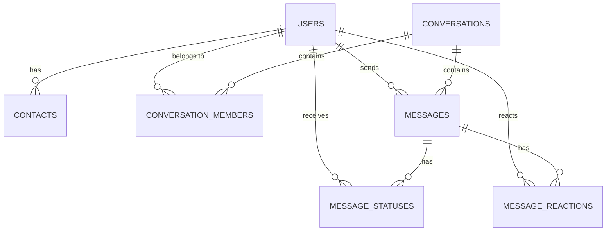

# Database Schema

The Signal Clone utilizes a strictly typed, normalized relational database schema powered by **SQLite** and managed via **SQLAlchemy ORM**.

## 📊 Entity Relationship (ER) Diagram

---

## 🗄️ Tables Overview

### 1. `users`
Stores all registered identities on the platform.

| Column | Type | Constraints | Description |
|--------|------|-------------|-------------|
| `id` | String | PK, UUID | Primary unique identifier |
| `phone` | String | Unique, Index | Used for registration/login |
| `username` | String | Unique, Index | Used for registration/login |
| `display_name` | String | Not Null | User's chosen display name |
| `password_hash` | String | Not Null | Bcrypt hashed password |
| `avatar_url` | String | Nullable | Link to profile picture |
| `bio` | String | Nullable | User status/bio |
| `created_at` | DateTime | Not Null | Account creation timestamp |

### 2. `contacts`
A self-referential mapping table representing a user's address book.

| Column | Type | Constraints | Description |
|--------|------|-------------|-------------|
| `id` | String | PK, UUID | Primary unique identifier |
| `user_id` | String | FK(`users.id`) | The owner of the contact list |
| `contact_user_id` | String | FK(`users.id`) | The user being added |
| `nickname` | String | Nullable | Optional local alias for contact |
| `is_blocked` | Boolean | Default `False` | Privacy control |
| `created_at` | DateTime | Not Null | When contact was added |

*Note: A unique constraint exists on `(user_id, contact_user_id)` to prevent duplicate contacts.*

### 3. `conversations`
Represents both Direct Messages (1-on-1) and Group Chats.

| Column | Type | Constraints | Description |
|--------|------|-------------|-------------|
| `id` | String | PK, UUID | Primary unique identifier |
| `is_group` | Boolean | Default `False` | Determines chat type |
| `name` | String | Nullable | Group name (Null for DMs) |
| `description` | String | Nullable | Group bio/description |
| `avatar_url` | String | Nullable | Group profile picture |
| `created_at` | DateTime | Not Null | Creation timestamp |
| `updated_at` | DateTime | Not Null | Used to sort inbox by recency |

### 4. `conversation_members`
A join table linking `users` to `conversations`.

| Column | Type | Constraints | Description |
|--------|------|-------------|-------------|
| `id` | String | PK, UUID | Primary unique identifier |
| `conversation_id` | String | FK(`conversations.id`) | The conversation |
| `user_id` | String | FK(`users.id`) | The participant |
| `is_admin` | Boolean | Default `False` | Group management rights |
| `joined_at` | DateTime | Not Null | When user was added |

### 5. `messages`
Stores the actual message payloads.

| Column | Type | Constraints | Description |
|--------|------|-------------|-------------|
| `id` | String | PK, UUID | Primary unique identifier |
| `conversation_id` | String | FK(`conversations.id`) | Where the message lives |
| `sender_id` | String | FK(`users.id`) | Who sent it |
| `text` | Text | Nullable | Message content |
| `message_type` | String | Default `'text'` | `text`, `image`, `system` |
| `media_url` | String | Nullable | Link to attachment |
| `created_at` | DateTime | Not Null | Timestamp of sending |

### 6. `message_statuses`
Tracks the complex state of a message's delivery across multiple recipients (crucial for group chats).

| Column | Type | Constraints | Description |
|--------|------|-------------|-------------|
| `id` | String | PK, UUID | Primary unique identifier |
| `message_id` | String | FK(`messages.id`) | The message |
| `user_id` | String | FK(`users.id`) | The recipient |
| `status` | String | Enum | `sent`, `delivered`, `read` |
| `updated_at` | DateTime | Not Null | When the status changed |

### 7. `message_reactions`
Tracks emoji reactions to specific messages.

| Column | Type | Constraints | Description |
|--------|------|-------------|-------------|
| `id` | String | PK, UUID | Primary unique identifier |
| `message_id` | String | FK(`messages.id`) | The message |
| `user_id` | String | FK(`users.id`) | The reactor |
| `emoji` | String | Not Null | Unicode emoji character |
| `created_at` | DateTime | Not Null | Timestamp of reaction |

---

## 🔑 Indexes & Performance

To maintain high performance as the database scales, the following indexes are strictly maintained:
1. `users.phone` and `users.username` for O(1) authentication lookups.
2. `contacts.user_id` for fast address book loading.
3. `messages.conversation_id` combined with `messages.created_at` for rapid pagination of chat histories.
4. `conversation_members.user_id` to quickly load a user's inbox on startup.

## 🗃️ Normalization

The schema is in **3rd Normal Form (3NF)**:
- No repeating groups (e.g., `MessageStatuses` handles variable recipient lists for groups).
- No partial dependencies (every non-key attribute depends on the full primary key).
- No transitive dependencies (e.g., recipient names are derived by joining the `Users` table, rather than caching them on the `Message`).
