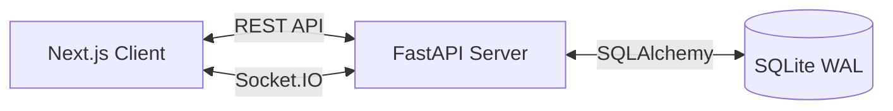

<div align="center">
  
  <h1>Signal Clone</h1>
  <p><em>A production-grade, real-time messaging platform inspired by Signal Desktop.</em></p>

  [](https://nextjs.org/)
  [](https://www.typescriptlang.org/)
  [](https://fastapi.tiangolo.com/)
  [](https://sqlite.org/)
  [](https://socket.io/)
</div>

<br />

> **Note:** This is a demonstration project built to showcase a full-stack real-time messaging architecture. It uses **mocked authentication** and **simulated encryption** for ease of evaluation. No real SMS integration is present.

## 📖 Project Overview

This project is a highly polished, full-stack clone of the Signal Desktop messaging application. It was built to demonstrate a production-ready messaging architecture using modern technologies. The application focuses on providing a snappy, reliable, and aesthetically pleasing user experience while maintaining a robust, scalable backend architecture.

### Motivation
The goal of this project was to replicate the complex real-time state management, WebSocket communication, and professional UI/UX of a world-class messaging application like Signal, demonstrating the ability to handle distributed state across a client-server architecture.

---

## ✨ Features

- **Authentication:** Phone number and username registration, session persistence, JWT auth. (Note: Uses Mock OTP).
- **Contacts:** Strictly separated contact books. Add contacts by exact phone number.
- **Messaging:** Real-time 1-on-1 and Group messaging.
- **Delivery Status:** Real-time Sent, Delivered, and Read receipts.
- **Typing Indicators:** Real-time typing awareness.
- **Groups:** Create groups, add members, promote/demote admins, and remove members.
- **UI/UX:** Pixel-perfect Signal Desktop inspired dark mode UI, smooth framer-motion animations, responsive design.

---

## 🛠 Tech Stack

### Frontend
- **Framework:** Next.js (App Router, React 18)
- **Language:** TypeScript
- **Styling:** TailwindCSS
- **State Management:** Zustand (Auth, Chat, UI stores)
- **Data Fetching:** React Query & native fetch
- **Real-time:** Socket.IO Client
- **Animations:** Framer Motion

### Backend
- **Framework:** FastAPI (Python 3.10+)
- **Database:** SQLite (in WAL mode for concurrency)
- **ORM:** SQLAlchemy
- **Real-time:** python-socketio

---

## 🏗 Architecture

The system follows a strict client-server architecture separated by REST APIs for persistent operations and WebSockets for real-time ephemeral state.

**Why FastAPI?** 
FastAPI was chosen for its high performance, native async support, and automatic OpenAPI documentation generation. It pairs perfectly with `python-socketio` for handling thousands of concurrent WebSocket connections efficiently.

**Why SQLite?**
SQLite was chosen for simplicity of deployment in a demonstration environment. It is configured in **WAL (Write-Ahead Logging)** mode to handle concurrent reads and writes effectively, mimicking the behavior of a larger relational database like PostgreSQL.

**Why Socket.IO?**
Socket.IO provides reliable real-time communication with built-in connection recovery, automatic fallback to long-polling, and room-based broadcasting (perfect for group chats).

**Why Zustand & React Query?**
Zustand handles global UI and Chat state with minimal boilerplate, while React Query handles caching, deduping, and background refreshing of REST API data.



For more details, see the [System Architecture Guide](./SYSTEM_ARCHITECTURE.md).

---

## 📂 Folder Structure

```text
signal-clone/
├── frontend/                 # Next.js Application
│   ├── app/                  # App Router pages (login, register, main)
│   ├── components/           # Reusable UI components (Sidebar, Chat, Modals)
│   ├── hooks/                # Custom React hooks (useSocket)
│   ├── store/                # Zustand global state stores
│   ├── services/             # API client and WebSocket handlers
│   └── types/                # TypeScript interfaces
└── backend/                  # FastAPI Application
    ├── app/
    │   ├── api/              # REST API Routes (auth, contacts, messages)
    │   ├── core/             # Security, config, JWT logic
    │   ├── db/               # Database setup and connection
    │   ├── models/           # SQLAlchemy DB Models
    │   ├── schemas/          # Pydantic validation schemas
    │   ├── repositories/     # Data access layer (CRUD)
    │   └── websockets/       # Socket.IO event handlers
```

---

## 🚀 Installation & Setup

### Prerequisites
- Node.js (v18+)
- Python (3.10+)

### 1. Backend Setup
```bash
cd backend
python -m venv .venv
source .venv/bin/activate  # On Windows: .\.venv\Scripts\activate
pip install -r requirements.txt

# Seed the database with demo users and messages
python app/seed/seed_db.py

# Run the server
uvicorn app.main:app --reload
```
*Backend runs on http://localhost:8000*

### 2. Frontend Setup
```bash
cd frontend
npm install
npm run dev
```
*Frontend runs on http://localhost:3000*

---

## ⚙️ Environment Variables

### Backend (`backend/.env`)
```env
SECRET_KEY=your_super_secret_jwt_key
ALGORITHM=HS256
ACCESS_TOKEN_EXPIRE_MINUTES=1440
DATABASE_URL=sqlite:///./signal.db
```

### Frontend (`frontend/.env.local`)
```env
NEXT_PUBLIC_API_URL=http://localhost:8000/api
NEXT_PUBLIC_SOCKET_URL=http://localhost:8000
```

---

## 🔐 Demo Credentials

To easily evaluate the application, the database is pre-seeded with the following users:

| Name | Phone Number | Username |
|------|--------------|----------|
| Amit Desai | +91 9000000001 | amit |
| Priya Patel | +91 9000000002 | priya |
| Kevin Thomas | +91 9000000003 | kevin |
| Divya Sharma | +91 9000000004 | divya |
| Rahul Singh | +91 9000000005 | rahul |

**Authentication Details:**
- **Password:** `password123` (for all users)
- **Mock OTP:** `123456`

> **Note:** This project uses mocked authentication and fixed OTP verification for demonstration purposes. No real SMS verification is performed.

---

## 📸 Screenshots

| Login Page | Register Page |
|------------|---------------|
| *(Login Screenshot Placeholder)* | *(Register Screenshot Placeholder)* |

| Main Chat Interface | Group Management |
|---------------------|------------------|
| *(Chat Screenshot Placeholder)* | *(Group Screenshot Placeholder)* |

| Add Contact | Settings |
|-------------|----------|
| *(Contact Screenshot Placeholder)* | *(Settings Screenshot Placeholder)* |

---

## 📊 Database Design

The schema is highly normalized. Key entities include:
- **Users**: Core identities.
- **Contacts**: Self-referential many-to-many relationship tracking address books.
- **Conversations**: Both Direct Messages and Groups.
- **ConversationMembers**: Tracks who is in which conversation and their admin status.
- **Messages**: Core message payload.
- **MessageStatuses**: Tracks delivered/read state per user per message.

For an ER Diagram and detailed breakdown, see [Database Schema](./DATABASE_SCHEMA.md).

---

## 🌐 API & Real-Time Communication

The application uses standard REST APIs for fetching historical data and performing state mutations (e.g., creating a group). 
WebSockets are used strictly for real-time ephemeral events and pushing updates to connected clients.

**WebSocket Events:**
- `send_message` / `receive_message`
- `typing`
- `read_receipt` / `delivery_receipt`
- `group_updated`

For full documentation, see [API Documentation](./API_DOCUMENTATION.md).

---

## 🚢 Deployment

- **Frontend:** Deployed on Vercel.
- **Backend:** Deployed on Render.
- **Database:** SQLite (Stored on persistent disk volume on Render).

For detailed deployment instructions, see the [Deployment Guide](./DEPLOYMENT_GUIDE.md).

---

## ⚡ Performance Optimizations

1. **Optimistic Updates:** The UI updates instantly when sending a message or adding a contact, before the server responds, ensuring a snappy feel.
2. **SQLite WAL Mode:** Write-Ahead Logging allows simultaneous readers and writers, preventing database lockups during heavy message broadcasting.
3. **Lazy Loading:** The React tree is code-split, and Modals are lazily mounted only when opened.
4. **React Query:** Aggressive client-side caching prevents redundant API calls for user profiles and contacts.

---

## 🔒 Security Notes

- **Password Hashing:** Passwords are hashed using `bcrypt` before storage.
- **JWT Sessions:** Stateless JSON Web Tokens are used for session management with short expiries and refresh mechanisms.
- **Input Validation:** Pydantic strictly validates all incoming API payloads.
- **Mock Authentication:** OTPs are mocked for demo purposes.
- **Simulated Encryption:** True E2EE is complex to demonstrate in a browser without browser extensions. Encryption is visually simulated in the UI to match Signal's aesthetic.

For more details, see [Security](./SECURITY.md).

---

## ✅ Assignment Requirements Checklist

- [x] **Authentication** (Register, Login, Logout, Mock OTP, Session Persistence)
- [x] **Contacts** (Add Contact, Search Contact)
- [x] **Messaging UI** (Conversation List, Unread Indicator, Typing Indicator)
- [x] **Receipts** (Read Receipt, Delivery Receipt)
- [x] **Chat Types** (One-to-One Messaging, Group Messaging)
- [x] **Groups** (Create Group, Manage Members, Admin Controls)
- [x] **UI/UX** (Signal Inspired UI, Dark Theme, Responsive)
- [x] **Tech Stack** (SQLite, FastAPI, Next.js, TypeScript, WebSockets)
- [x] **Documentation** (README, System Architecture, API Docs, Deployment, etc.)

---

## 🚀 Future Improvements

- Image & File Sharing (AWS S3 Integration)
- Voice & Video Calls (WebRTC)
- Real End-to-End Encryption (Signal Protocol implementation via WebCrypto API)
- Desktop & Push Notifications
- Message Search & Pinned Chats

See [CHANGELOG](./CHANGELOG.md) for version history.

---

## 📜 License

This project is licensed under the MIT License - see the LICENSE file for details.

## 🙏 Acknowledgements

- **Signal Foundation:** For building an incredible, privacy-first messaging application that served as the inspiration for this clone.
- **Next.js & FastAPI Teams:** For creating the best-in-class frameworks for modern web development.
- **Shadcn UI & Lucide:** For the beautiful design system tokens and icons.

---
<div align="center">
  <i>Engineered with precision. Built for speed.</i>
</div>
