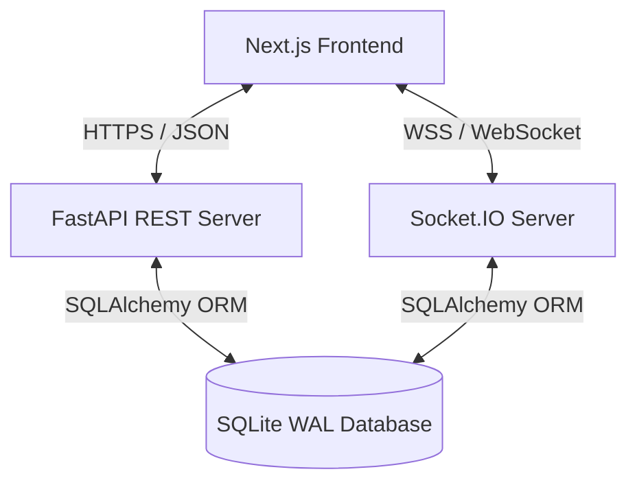
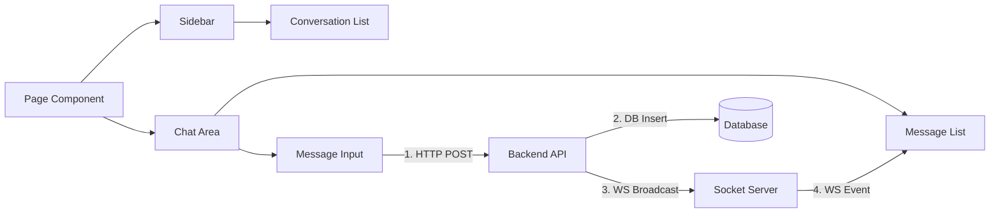
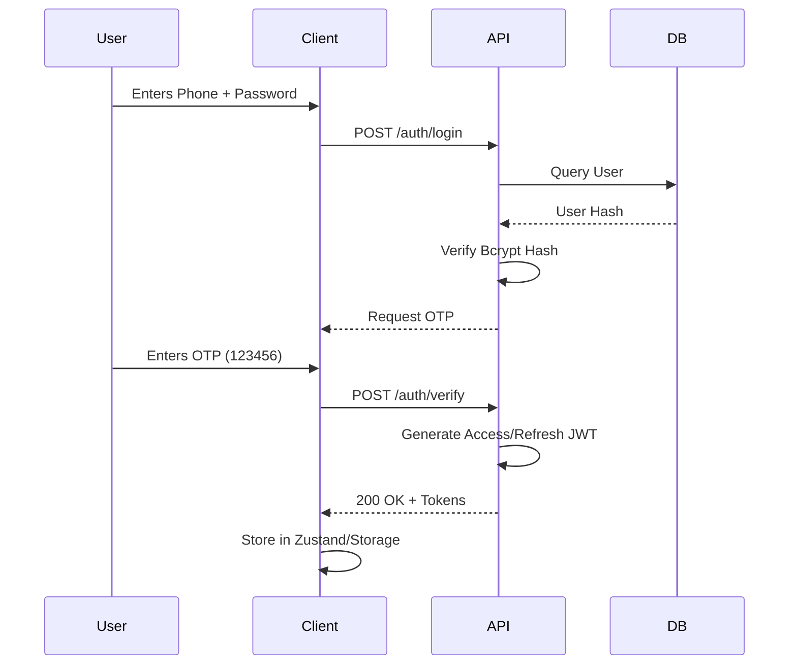
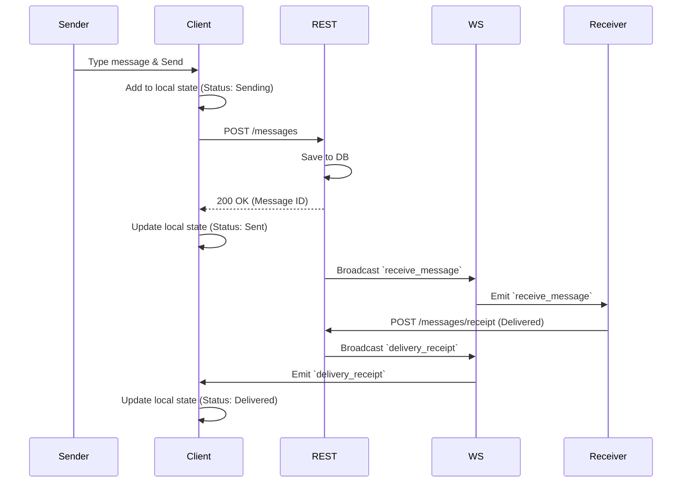
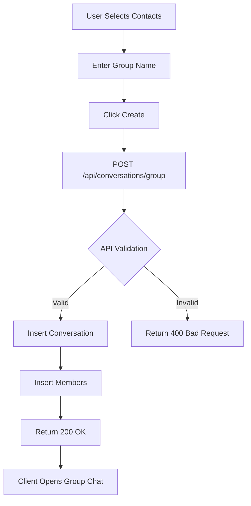

# System Architecture

This document provides a comprehensive overview of the Signal Clone system architecture. The application follows a modern decoupled architecture where the frontend and backend communicate via REST APIs for persistent state and WebSockets for real-time ephemeral events.

## 🏗 Overall Architecture

### Key Components

1. **Client (Next.js):** Responsible for the UI, global state management (Zustand), caching (React Query), and rendering.
2. **REST API (FastAPI):** Handles authentication, data retrieval (chat history, contacts), and persistent mutations (creating groups, updating profiles).
3. **WebSocket Server (python-socketio):** Handles real-time bi-directional events like typing indicators, read receipts, and live message delivery.
4. **Database (SQLite):** Configured in WAL (Write-Ahead Logging) mode to handle concurrent reads and writes, acting as the single source of truth.

---

## 💻 Frontend Architecture

The frontend is built using Next.js 15 (App Router) with React 18.

### State Management Strategy
- **Zustand:** Used for global, synchronous UI state (e.g., `isSidebarOpen`, `activeConversation`, `theme`).
- **React Query:** Used for server state. It caches responses (like the contact list), deduplicates requests, and handles background refetching.
- **Socket Context:** A custom React Context provider manages the Socket.IO connection lifecycle, attaching and detaching event listeners dynamically based on the active conversation.

### Component Interaction

---

## ⚙️ Backend Architecture

The backend is built with FastAPI and Python 3.10+, leveraging modern async paradigms.

### Layered Architecture
To maintain separation of concerns, the backend strictly follows a layered repository pattern:
1. **Routers (`app/api/`):** Define the HTTP endpoints, parse request bodies, and handle HTTP exceptions.
2. **Schemas (`app/schemas/`):** Pydantic models for strict input/output validation.
3. **Repositories (`app/repositories/`):** House all SQLAlchemy database queries. Routers never query the database directly.
4. **Models (`app/models/`):** SQLAlchemy declarative base classes representing the exact database schema.
5. **WebSockets (`app/websockets/`):** Event handlers for incoming socket connections and messages.

### Database Layer
SQLite is used for storage. To ensure it can handle the high-throughput nature of a messaging app:
- **WAL Mode:** Write-Ahead Logging is enabled on connection, allowing readers to read concurrently while a writer writes.
- **Connection Pooling:** SQLAlchemy manages a connection pool to prevent connection exhaustion.
- **Session Lifecycle:** A FastAPI dependency (`get_db`) yields a session per request and guarantees closure via `finally` blocks.

---

## 🔄 Core Flows

### 1. Authentication Flow
The system uses stateless JWT (JSON Web Token) authentication.

### 2. Messaging Flow (Optimistic Update)
When a user sends a message, the UI updates immediately before the server responds.

### 3. Group Creation Flow

---

## 🚀 Deployment Architecture

The application is designed for cloud-native deployment.

- **Frontend:** Compiled to static HTML/CSS/JS and Edge Functions via Vercel.
- **Backend:** Packaged as a standard Python application running via `uvicorn` (ASGI server) on Render.
- **Database:** SQLite file stored on a persistent disk volume mounted to the Render web service container.

*(Note: In a true massive-scale production environment, SQLite would be swapped for PostgreSQL, and Redis would be added as a Pub/Sub backend for Socket.IO to allow multi-node WebSocket scaling. The current architecture assumes a single-node backend suitable for demonstration).*
